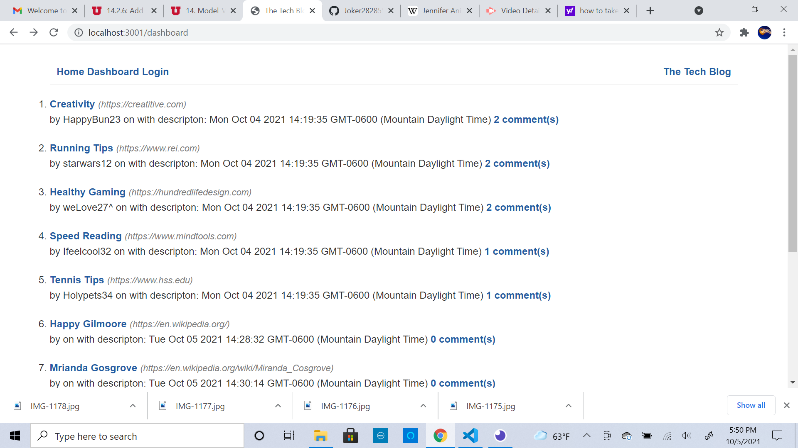

# Title:
Blogger Tech

# Application Description:
This application solves the problem of a developer not being able to reach out to other developers in other states or interacting with other developers they have not met in person. The application solves this problem by being a blog where developers of all skill levels can post articles on new coding concepts and procedures that are constantly added to the world of web developement. Developers are able to communicate with each other on this application through the ability to leave comments on articles that have already been posted and say wherther or not the article they read was useful or not.

# Application Organization:
This challenge had us do everything from scratch so I coded the frontend and backend from the ground up. I organized the background as restful api enviroment with a db folder for the database, connection folder to connect the server to the database, models folder for all of the tables, controllers folder for the routes, seeds folder for the actual data, and a public folder for all of the HTML, CSS, and Javascript code. The information associated with the user such as their username is stored in the User model. The information associated with posting an article to the blog is stored in the Post model. Information associated with a user leaving comments on articles that are posted to the blog are stored in the Comments model. Get routes are used to retireve information from each of the models used in the database. A post route allows users to post different articles to the blog and enables use to leave comments on articles they have read. A put route allows users to update any of the information he or she sees on the blog when an article is posted. The seeds folder has the files that are used to put information into the database before a user loads the application. 

The front end was organized through the use of handebars to create the different pages all that make up the blog. The home-routes folder is what puts all of the information from the databse onto the blog when it loads. The user is presented with links in the top left corner with the articles posted underneath the links. The links are for the homepage, dashboard, and login. Cliking on any of these links gives the user a prompt that says would you like to sign in and sends the user to the login page when clicked on. The login page prompts the user to enter their username, email, and password. After a person has signed in they are rerouted to another page that has links for the homepage dashboard and logout links at the top with the articles that have been posted to the blog. A link that gives the user the option to create their own post appears at the bottom of the page when the dashboard link is clicked. A link underneath the url adress for the article takes the user to the comment page. The comment page has a texbox where the user can leave their comment which appears below the textbox once they click the add comment button.

# Running The Application
The first step in running this application is to make sure the computer has the necessary software to run the application. The software the computer needs is Visual Studio Code, Insomnia, Gitbash, and Node.js. The links to download these applications is provided below.
- <a href="https://code.visualstudio.com/docs/setup/setup-overview">Visual Studio Code Download</a>
- <a href="https://git-scm.com/downloads">Gitbash Download</a>
- <a href="https://nodejs.org/en/">Node.js Download</a>
- <a href="https://insomnia.rest/">Insomnia Download</a>

After visual studio code is done downloading the link to the source code needs to be downloaded from my github respository. The link to my github repository is provided down below.
- <a href="https://github.com/Joker282855/blogger-tech">Github Repository</a>
Click on the green code button in the top right corner to get the link and choose the https option. Open a terminal in visual studio code after copying the link for the source code and type the command git clone. Double click after typing git clone to put in the link for the source code and hit enter to download the code. 

To get the code working with visual studio code with need to install some packages from the Node.js library. The packages are installed by typing the command npm i inside the visual studio code terminal. After the packages are done installing typing the command npm start will connect the server to our application and running up on the web. The link for the application after npm start is entered is http://localhost:3001.

# Challenge Tasks:
1. When the user visits the site they are presented with a website that shows them exisitng blog posts, a navigation bar on the dashboard and a login page
2. The homepage link takes the user to the homepage when clicked on
3. Clicking on any links means that the user is either taken to the sign up page or the sign out page
4. When the person signs up then they are prompted to fill out a username and password
5. When a user clicks signup there credentials are saved and they are taken to the login page
6. When a user revisits the site they are given the choice to reenter their username and password
7. When a user is signed in to the site they can see the logout button the link to the dashboard and the homepage
8. Basically the other tasks were to have a user be able to create a new blog post and use routes to update or get rid of a post
9. The last few tasks were having the user sign in again if they were ever idle

# Challenge Tasks Achieved By:
These tasks were achieved by looking at module 14 and revewing the lesson material. It helped as a guide when I had to create posts and had to update an existing post. Time management helps a lot with this assignment as well.

# Screenshot:

# Link to Application
<a href="https://immense-lake-76806.herokuapp.com/">Link to Application</a>

# Contributors:
Made with love by Josh Jackson